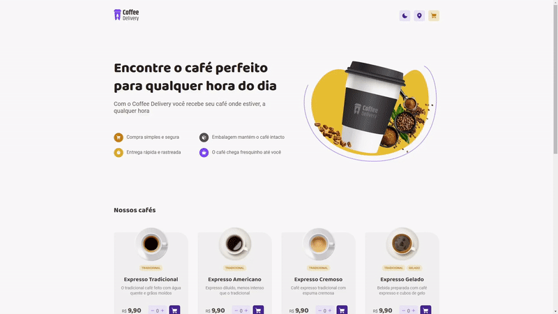

<p align="center">
  
</p>

# [Coffee Delivery](https://coffee-delivery-legeannd.vercel.app/)
     

<p align="center">
  
</p>


* [Content (en-US)](#section-en_us)
* [Conteúdo (pt-BR)](#secao-pt_br)

---

## About the project <a id="section-en_us"></a>

This is a coffee delivery app created in React and Typescript where the user can add coffees to the cart to make the order and see all the selected coffees in the checkout page. In the checkout page, the user can add your zipcode and the app will fill the current available address data automatically based in a web request if the zipcode is valid. In addition, the app has a dark theme mode, where it changes all the components colors to fit into the dark theme. 

## Content
  * [Techs](#techs)
  * [How to run the project](#installation)
    * [Installation - Frontend](#installation-front)

## Techs <a id="techs"></a>

- [x] React Query
- [x] React Router DOM
- [x] Immer
- [x] Styled Components

## How to execute the project <a id="installation"></a>
To execute the project, you'll need to have Node and NPM or Yarn installed to setup all the dependencies.


### Installation - Front-end (Web) <a id="installation-front"></a>

In the project root folder:

```bash
npm install
npm run dev
```

If you are using Yarn, use this:
```bash
yarn install
yarn dev
```

<!-- Remember to create a .env file to put the enviroment variables exemplified in the .env.example file with your personal data. -->

After finishing installation, the web page will be open in your browser.

---

## Sobre o projeto <a id="secao-pt_br"></a>

Este é um aplicativo de entrega de café criado em React e Typescript onde o usuário pode adicionar cafés ao carrinho para fazer o pedido e ver todos os cafés selecionados na página de checkout. Na página de checkout, o usuário pode adicionar seu CEP e o aplicativo preencherá os dados de endereço disponíveis no momento automaticamente com base em uma requisição web se o CEP for válido. Além disso, o aplicativo possui um modo de tema escuro, onde muda todas as cores dos componentes para se adequar ao tema escuro.

## Conteúdos
  * [Tecnologias](#tecnlogias)
  * [Como executar o projeto](#instalacao)
    * [Instalação - Front-end](#instalacao-front)

## Tecnologias <a id="tecnologias"></a>

- [x] React Query
- [x] React Router DOM
- [x] Immer
- [x] Styled Components

## Como executar o projeto <a id="instalacao"></a>
Para executar o projeto, você irá precisar ter o Node e o NPM ou Yarn instalados para baixar as dependências.


### Instalação - Front-end (Web) <a id="instalacao-front"></a>

Na pasta raíz do repositório:

```bash
npm install
npm run dev
```

Se estiver usando Yarn, utilize
```bash
yarn install
yarn dev
```

<!-- Lembre-se de criar um arquivo .env para colocar as variáveis de ambiente exemplificadas no arquivo .env.example com os seus dados pessoais. -->

Quando terminar, a página da aplicação web será aberta no navegador.

---
###### Developed by [Gean Lucas](https://www.linkedin.com/in/geanlucaas/) :rocket:.